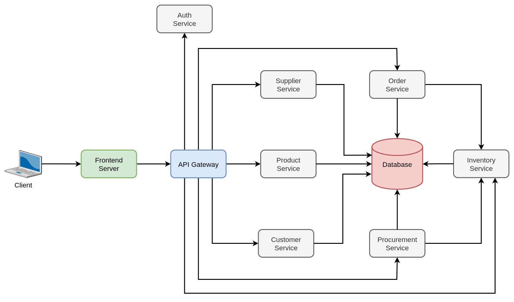

# Inventory Microservices System

A complete microservices-based inventory management system built with Flask, FastAPI, Vue 3, Redis, and MySQL.



## Architecture Overview

The system consists of 7 independent microservices communicating via Redis pub/sub for eventual consistency:

1. **Auth Service** (Port 5003) - JWT authentication with 6-hour token expiry
2. **Supplier Service** (Port 5004) - Supplier CRUD operations
3. **Customer Service** (Port 5005) - Customer CRUD operations  
4. **Product Service** (Port 5000) - Product management with supplier relationships and cache updates
5. **Inventory Service** (Port 5006) - Stock management via `/inventory` endpoints
6. **Procurement Service** (Port 5001) - Purchase orders from suppliers
7. **Order Service** (Port 5002) - Sales orders to customers

### Key Design Decisions

- **Single Warehouse**: Removed warehouses table, all inventory managed in one location
- **Normalized IDs**: All relationships use integer IDs instead of string codes/names
- **Event-Driven**: Services communicate via Redis pub/sub channels for eventual consistency
- **Circuit Breaker**: 5-failure threshold, 30-second timeout for cross-service calls
- **Caching Strategy**: Redis cache-aside pattern (entities 24h TTL, transactions 1h TTL)
- **JWT Authentication**: 6-hour token expiry stored in sessionStorage
- **Supervisor Pattern**: Auto-restart consumer processes with exponential backoff (max 3 retries)
- **Synchronous Cache Warming**: Services block on startup until cache is loaded

## Database Schema

```sql
-- Core entities
users (id, username, email, password_hash, created_at)
suppliers (id, name, city, address, contact_person)
customers (id, name, city, address, contact_person)
products (id, product_code, name, category, price_buy, price_sell, measure_unit, supplier_id)
storages (id, product_id, quantity)

-- Transactions (normalized + denormalized for historical accuracy)
procurements (id, supplier_id, product_id, quantity, unit_price, total_cost, timestamp, 
                     supplier_name, product_code, product_name, ...)
orders (id, customer_id, product_id, quantity, unit_price, total_cost, timestamp,
                       customer_name, product_code, product_name, ...)
```

## Event System

### Redis Pub/Sub Channels

- **supplier_events**: supplier_created, supplier_updated, supplier_deleted
- **customer_events**: customer_created, customer_updated, customer_deleted  
- **product_events**: product_created, product_updated, product_deleted
- **procurement_stock_in**: {product_id, quantity} - triggers inventory increase
- **order_stock_out**: {product_id, quantity} - triggers inventory decrease
- **inventory_alert**: Low stock warnings (quantity < 10)

### Consumer Process Supervision

Each service with consumers uses `ProcessSupervisor`:
- Monitors consumer process health every 5 seconds
- Auto-restarts on failure with exponential backoff (1s, 2s, 4s)
- Maximum 3 restart attempts before giving up
- Graceful shutdown on service termination

## Running the System

### Prerequisites

- Docker & Docker Compose
- Python 3.9+
- Node.js 18+

### Quick Start

1. **Run database migration**:
```bash
# Apply migration to normalize schema
mysql -h localhost -P 32000 -u root -proot inventory_db < database/migration/001_microservices_restructure.sql
```

2. **Start all services**:
```bash
docker-compose up --build
```

Services will start in dependency order:
1. Infrastructure (MySQL, Redis)
2. Core services (Auth, Supplier, Customer)
3. Dependent services (Product, Inventory, Procurement, Order)
4. API Gateway
5. Frontend

### Access Points

- **Frontend**: http://localhost:8080
- **API Gateway**: http://localhost:8000
- **MySQL**: localhost:32000 (user: root, password: root)
- **Redis**: localhost:6379

### Individual Service URLs

- Auth: http://localhost:5003
- Product: http://localhost:5000
- Supplier: http://localhost:5004
- Customer: http://localhost:5005
- Inventory: http://localhost:5006
- Procurement: http://localhost:5001
- Order: http://localhost:5002

## API Endpoints

### Authentication (Public)

```bash
POST /api/auth/register
{
  "username": "admin",
  "email": "admin@example.com",
  "password": "password123"
}

POST /api/auth/login
{
  "username": "admin",
  "password": "password123"
}
# Returns: {"token": "jwt_token", "user": {...}}
```

### Products (Protected)

```bash
GET /api/products?start=0&limit=50
POST /api/products
{
  "product_code": "P001",
  "name": "Product Name",
  "category": "Electronics",
  "price_buy": 100.00,
  "price_sell": 150.00,
  "measure_unit": "pcs",
  "supplier_id": 1
}
GET /api/products/{id}
PUT /api/products/{id}  # Updates cache automatically
DELETE /api/products/{id}
```

### Suppliers (Protected)

```bash
GET /api/suppliers?start=0&limit=50
POST /api/suppliers
{
  "name": "Supplier Name",
  "city": "New York",
  "address": "123 Main St",
  "contact_person": "John Doe"
}
GET /api/suppliers/{id}
PUT /api/suppliers/{id}
DELETE /api/suppliers/{id}
GET /api/suppliers/city/{city}
```

### Customers (Protected)

```bash
GET /api/customers?start=0&limit=50
POST /api/customers
{
  "name": "Customer Name",
  "city": "Boston",
  "address": "456 Oak Ave",
  "contact_person": "Jane Smith"
}
GET /api/customers/{id}
PUT /api/customers/{id}
DELETE /api/customers/{id}
GET /api/customers/city/{city}
```

### Inventory (Protected)

```bash
GET /api/inventory?start=0&limit=50
POST /api/inventory
{
  "product_id": 1,
  "quantity": 100
}
GET /api/inventory/{id}
PUT /api/inventory/{id}
GET /api/inventory/product/{product_id}
```

### Procurements (Protected)

```bash
GET /api/procurements?start=0&limit=50
POST /api/procurements
{
  "supplier_id": 1,
  "product_id": 1,
  "quantity": 50,
  "unit_price": 100.00
}
# Publishes procurement_stock_in event -> Inventory increases stock

GET /api/procurements/product/{product_id}
GET /api/procurements/supplier/{supplier_id}
```

### Orders (Protected)

```bash
GET /api/orders?start=0&limit=50
POST /api/orders
{
  "customer_id": 1,
  "product_id": 1,
  "quantity": 10,
  "unit_price": 150.00
}
# Publishes order_stock_out event -> Inventory decreases stock

GET /api/orders/product/{product_id}
GET /api/orders/customer/{customer_id}
```

## Development

### Backend Service Structure

Each service follows this pattern:

```
service_name/
├── main.py              # Flask app, routes, cache warming, supervisor
├── app.py               # Flask app factory
├── config.py            # Environment variables
├── db.py                # SQLAlchemy setup
├── models/              # SQLAlchemy models
├── schemas/             # Marshmallow schemas
├── resources/           # API endpoints
├── libs/                # Pagination, validation helpers
├── Dockerfile
└── requirements.txt
```

### Shared Utilities

Located in `message_queue/`:

- **circuit_breaker.py**: CircuitBreaker class (CLOSED/OPEN/HALF_OPEN states)
- **cache.py**: Redis caching (warm_cache_sync, get_or_fetch_with_breaker)
- **event_system.py**: EventPublisher, EventConsumerProcess base classes
- **supervisor.py**: ProcessSupervisor, MultiProcessSupervisor

### Frontend Structure

```
frontend/src/
├── App.vue              # Main layout with auth-aware navigation
├── main.js              # Vue app entry point
├── router/
│   └── index.js         # Routes with auth guards
├── services/
│   └── api.js           # Axios services with JWT interceptors
├── views/
│   ├── LoginView.vue
│   ├── RegisterView.vue
│   ├── ProductsView.vue
│   ├── SuppliersView.vue
│   ├── CustomersView.vue
│   ├── StoragesView.vue    # Uses /inventory API endpoints
│   ├── ProcurementsView.vue
│   └── OrdersView.vue
└── components/
    ├── PageHeader.vue
    ├── Modal.vue
    ├── LoadingSpinner.vue
    └── ...
```

## Testing

### Health Checks

All services expose `/health` endpoint:

```bash
curl http://localhost:5003/health  # Auth
curl http://localhost:5000/health  # Product
curl http://localhost:5004/health  # Supplier
curl http://localhost:5005/health  # Customer
curl http://localhost:5006/health  # Inventory
curl http://localhost:5001/health  # Procurement
curl http://localhost:5002/health  # Order
curl http://localhost:8000/health  # API Gateway
```

### Manual Testing Flow

1. **Register**: POST /api/auth/register
2. **Login**: POST /api/auth/login (get JWT token)
3. **Create Supplier**: POST /api/suppliers
4. **Create Product**: POST /api/products (with supplier_id)
5. **Create Customer**: POST /api/customers
6. **Create Procurement**: POST /api/procurements (stock increases automatically)
7. **Check Inventory**: GET /api/inventory
8. **Create Order**: POST /api/orders (stock decreases automatically)
9. **Verify Stock Updated**: GET /api/inventory/product/{id}

### Monitoring Events

Watch Redis pub/sub in real-time:

```bash
docker exec -it redis_queue redis-cli
> SUBSCRIBE supplier_events customer_events product_events procurement_stock_in order_stock_out inventory_alert
```

## Recent Updates

### Cache Update Fix (February 2026)

Fixed a critical bug in the Product service where cache was not being updated after product updates. The `update_product` endpoint now properly:
- Updates cached product data with `cache_entity()` after database commit
- Invalidates list cache with `invalidate_list_cache()` to ensure query consistency
- This fix ensures price updates and other product modifications are immediately reflected across the system

## Troubleshooting

### Service Won't Start

- Check health of dependencies: `docker-compose ps`
- View logs: `docker-compose logs [service_name]`
- Verify database migration applied
- Ensure Redis is running

### Authentication Failures

- Check JWT token in browser sessionStorage
- Verify token not expired (6-hour limit)
- Check Auth service logs: `docker-compose logs auth`

### Stock Not Updating

- Check Inventory consumer process: `docker-compose logs inventory`
- Verify events published: Monitor Redis channels
- Check supervisor restart count in logs
- Ensure procurement/order services publishing events

### Circuit Breaker Open

- Check dependent service health
- Wait 30 seconds for half-open state
- Review failure threshold (default 5 failures)
- Check service logs for error details

## Production Considerations

### Security

- [ ] Change JWT_SECRET in production
- [ ] Use HTTPS for all communications
- [ ] Implement rate limiting on API Gateway
- [ ] Add API key authentication between services
- [ ] Use secrets management (Vault, AWS Secrets Manager)
- [ ] Enable CORS with specific origins

### Performance

- [ ] Add database indices on foreign keys
- [ ] Implement read replicas for heavy read services
- [ ] Use Redis Cluster for high availability
- [ ] Add CDN for frontend static assets
- [ ] Enable response compression
- [ ] Implement pagination on all list endpoints

### Monitoring

- [ ] Add Prometheus metrics exporters
- [ ] Set up Grafana dashboards
- [ ] Configure log aggregation (ELK, Splunk)
- [ ] Add distributed tracing (Jaeger, Zipkin)
- [ ] Set up alerting for circuit breaker trips
- [ ] Monitor Redis memory usage and eviction

### Resilience

- [ ] Implement service mesh (Istio, Linkerd)
- [ ] Add retry policies with exponential backoff
- [ ] Configure connection pooling
- [ ] Set up load balancers for each service
- [ ] Implement graceful shutdown handling
- [ ] Add database backup and restore procedures

## License

MIT

## Contributors

Built with ❤️ for learning microservices architecture.
